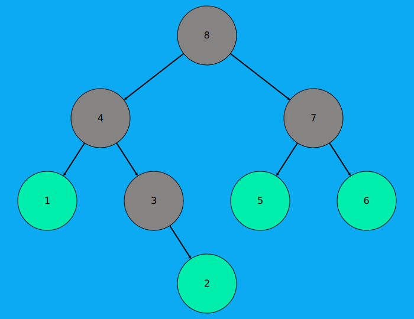
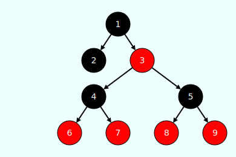

# bitreevis
[](https://pkg.go.dev/github.com/ryanreadbooks/bitreevis)

This repo is a tool which helps visualize binary tree structure in Golang. It is useful when debugging a program with binary tree structure.

# Prerequisites
* **[Go](https://golang.org/)**

# Installation
With Go module support (Go 1.11+), simply add the following import
```go
import "github.com/ryanreadbooks/bitreevis"
```
to your code. Or you can use the following the get this package.
```bash
$ go get -u github.com/ryanreadbooks/bitreevis
```

# Usage

## Quick start

Details can be found in [examples/svg_demo.go](examples/svg_demo.go).

### bitreevis.BiNode

In order to visualize your own binary tree, you should implement the `bitreevis.BiNode` interface. Then you can use `bitreevis.VisAsSvg()` function to visualize the binary tree in svg graphic format.

### bitreevis.RenderOption

`bitreevis.RenderOption` is used to define the output style of the visualization. The size of nodes, color of nodes, the width of edges, etc. can be customized by setting option.

 

## Private color for each node

If you want to paint different colors for different nodes. You should do the extra work after implementing the `bitreevis.BiNode` interface above, which is implementing the `bitreevis.PaintableBiNode`. For example, if you want to visualize a red-black tree, you can use private color for each node. See [example](examples/rb_tree.go).

 

# Learn more

* [Tidier Drawings of Trees](https://ieeexplore.ieee.org/document/1702828) algorithm, which is the layout calculation used in bitreevis
* [Examples](examples)

